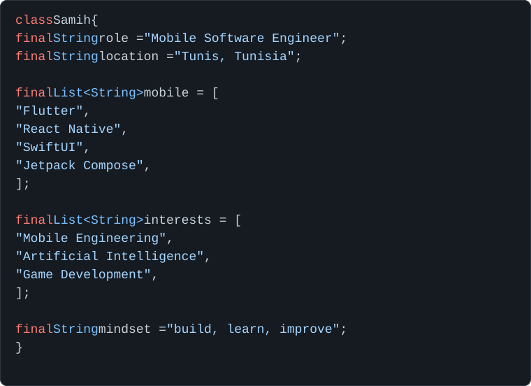

 

 

<table>
<tr>
<td width="55%" valign="top">

<h2>🍄 About me</h2>

Computer Science Engineering graduate specializing in <b>Mobile &amp; AI Development</b>.

I enjoy building mobile experiences, connecting them to solid backend systems, and experimenting with AI, game development, and embedded systems.

</td>

<td width="45%" valign="top">

<h2>Right now</h2>

<ul>
  <li>Deepening my mobile engineering skills</li>
  <li>Improving architecture &amp; code quality</li>
  <li>Building stronger backend systems</li>
  <li>Exploring AI-powered experiences</li>
  <li>Keeping game development close</li>
  <li>Learning by building</li>
</ul>

 

<h3>A little philosophy</h3>

<pre><code>build
break
learn
improve
repeat</code></pre>

</td>
</tr>
</table>

🧰 Stack

Mobile

 

  

Backend

  

Other things I work with

 

 

🔒 Most of my development happens in private repositories, so the public activity on this profile only shows part of what I'm building.

🎓 Background

🍄 Contact

  

Always happy to connect, talk mobile, or exchange ideas over coffee ☕

 

  🍄 &nbsp;&nbsp; 🌿 &nbsp;&nbsp; 🍄

